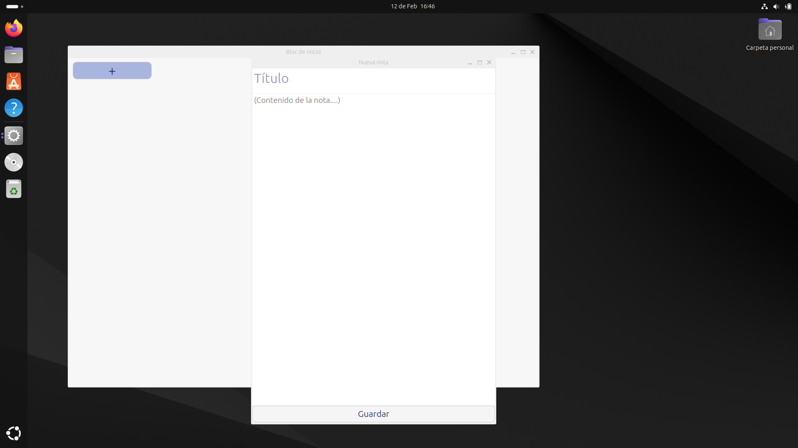
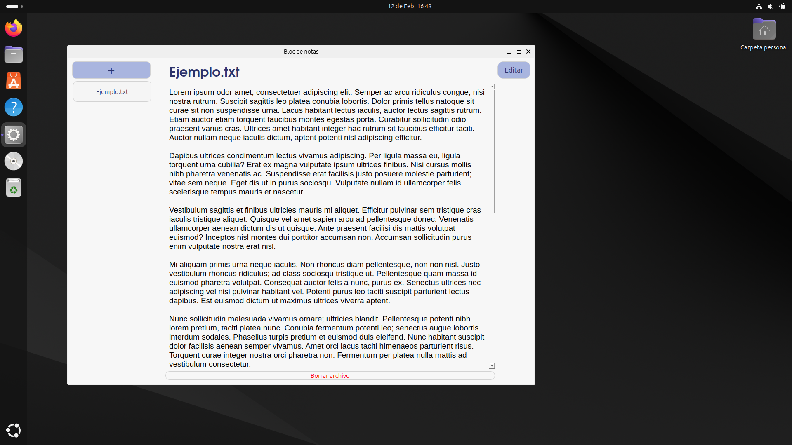

# 📝 ZeroBloc  
Bloc de notas sencillo para escritorio, desarrollado con PyQt5 que prioriza una interfaz ligera. Permite crear, editar y guardar archivos de texto (.txt) de forma rápida e intuitiva.  

## 📥 Instalación  
Descarga el ejecutable según tu sistema operativo:  
- 🐧 [Linux (64 Bits)](build/qtBloc_Linux.zip)
- 🖥️ [Windows (64 Bits)](build/qtBloc_windows.zip)

## Acerca del proyecto  
El código está escrito en Python 3.10 y las interfaces fueron diseñadas con Qt Designer e importadas con `pyuic5`, los ejecutables están hechos con Pyinstaller.  

## Interfaz   

## 📜 Licencia  
Este proyecto está bajo la licencia MIT.  
